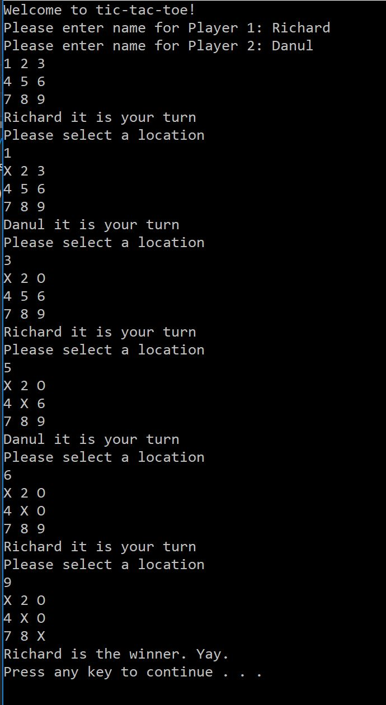

# LAB04-TICTACTOE
This project holds a minigame built in C# on a .NET console app. The purpose is to allow two users to play a tic tac toe game that will determine a winner or a tie.

## Visual

## Use
To run this app, clone the repo and open the .sln file on Visual Studio. Then compile the code and follow instructions on the console.

## Authors & Contributors
Richard Jimenez & Danul De Leon pair programmed this project.
Code Fellows for providing starter code.
